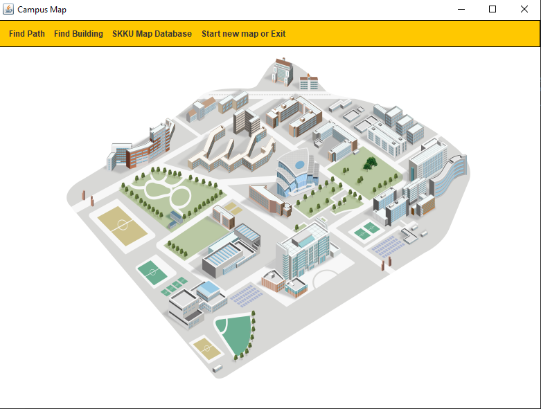
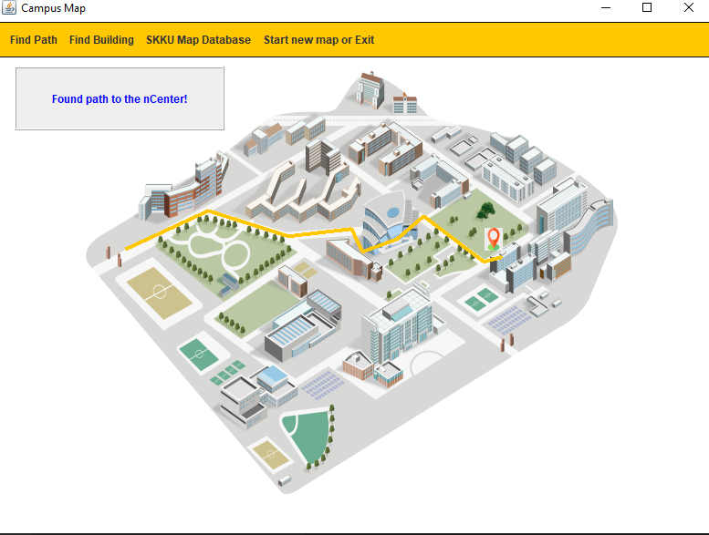
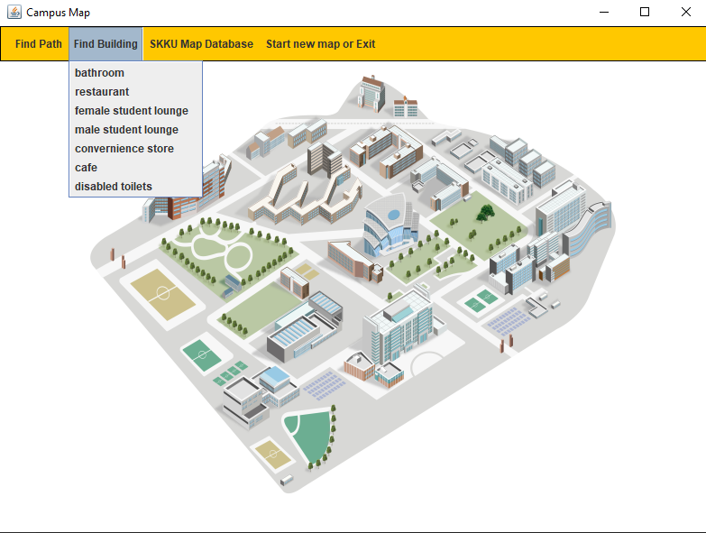
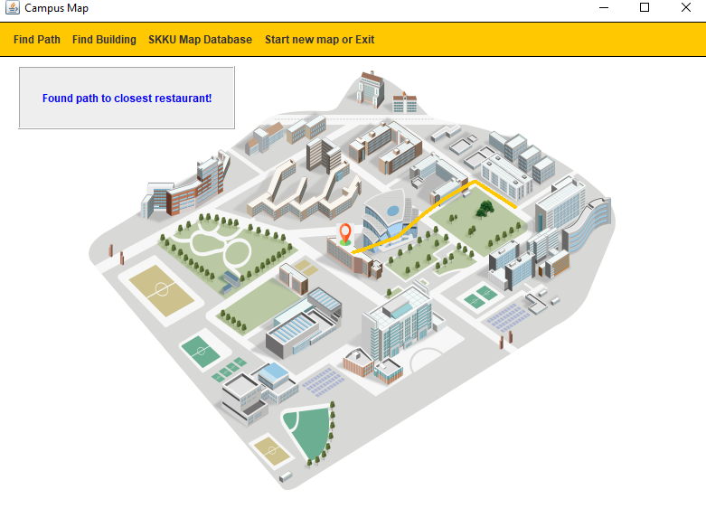
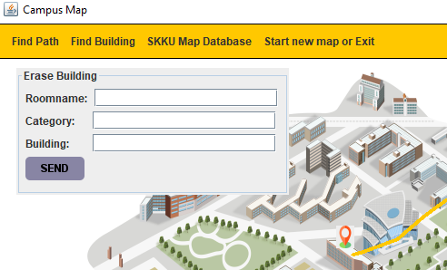
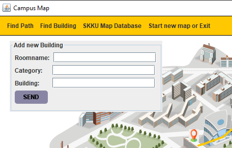

# UNIV_JAVA_TP_campus_map
## 성균관대학교 자바 프로그래밍 실습 27조 Term Project
### 이석훈, 김한규, 최규리 
 

### 코로나 19로 인한 학교 건물 출입문 일부 운영으로 인해 학교 내 원하는 건물로 빠르게 갈 수 있는 기능을 구현했습니다.
### 또한, 현재 내 위치를 입력하고, 화장실, 휴게실, 식당, 카페 등 필요한 장소를 고르면 그 장소가 있는 가장 가까운 건물로의 길을 찾아줍니다.

 

# 사용법 

 
클라이언트를 실행하면 위와 같은 GUI를 만날 수 있습니다.    

## Find path
Find Path 버튼을 누르게 되면, 사용자는 현재 위치와 원하는 건물을 누르도록 요청받습니다. 입력이 다 끝나면 GUI에 그 건물 까지의 최단 경로가 표시됩니다.

  이 경우 시작 지점을 학교 후문으로, 목적지 건물을 n Center로 누른 경우의 결과 입니다.  

## Find Building
Find building 버튼을 누르면 화장실, 식당, 성별 전용 휴게실, 카페, 장애인 전용 화장실의 메뉴를 볼 수 있습니다. 
사용자가 메뉴 중 하나를 고르면 현재 위치를 누르도록 요청받습니다. 
만약 사용자가 식당을 누르고 현재 위치를 눌렀다면 현재 위치에서 가장 가까운 식당으로 가는 경로가 표시됩니다. 

 

## SKKU Map Database
학교의 모든 장소를 조사할 수는 없었습니다. 또한, 후에 생길 새로운 화장실이나 식당, 카페 등이 생기는 경우   
혹은 기존의 장소가 사라지는 경우를 대비하여 SKKU Map Database 버튼이 있습니다.  
이 버튼을 누르면 사용자는 저희에게 새로운 장소의 정보나 제거해야 할 장소의 정보를 보낼 수 있습니다.   

   
이렇게 받아온 정보는 저희 데이터 베이스에 적용되고, 만약 새로운 건물이 추가되었다면 다음번 이용 시    
추가된 건물의 정보가 저희 프로그램에 반영됩니다. 따라서 사용자는 새로운 건물에 대한 길찾기도 이용 가능합니다.

## Start new map & EXIT
사용자가 길찾기를 한 다음, 한 번 더 검색하고 싶을 수 있습니다. 이 경우 맵을 깨끗한 상태로 초기화 할 수 있습니다.
마찬가지로, 앱 종료를 할 수 있습니다.

  

# 개발환경

- JAVA 17
- MYSQL & JDBC
- JFRAME
- SDK 17
- Socket Programming